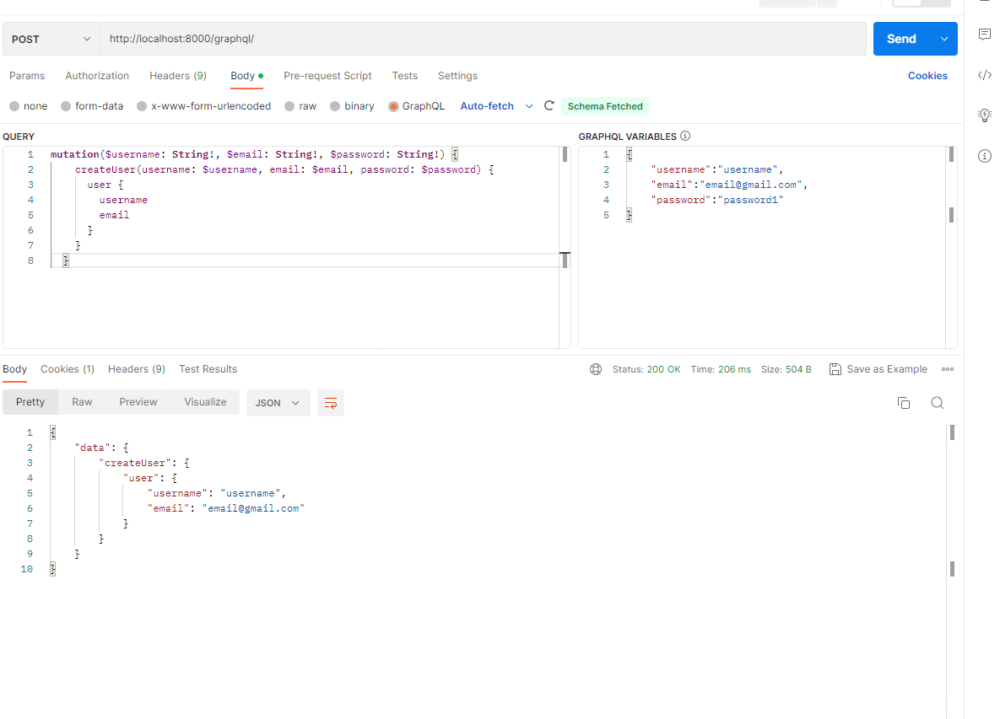
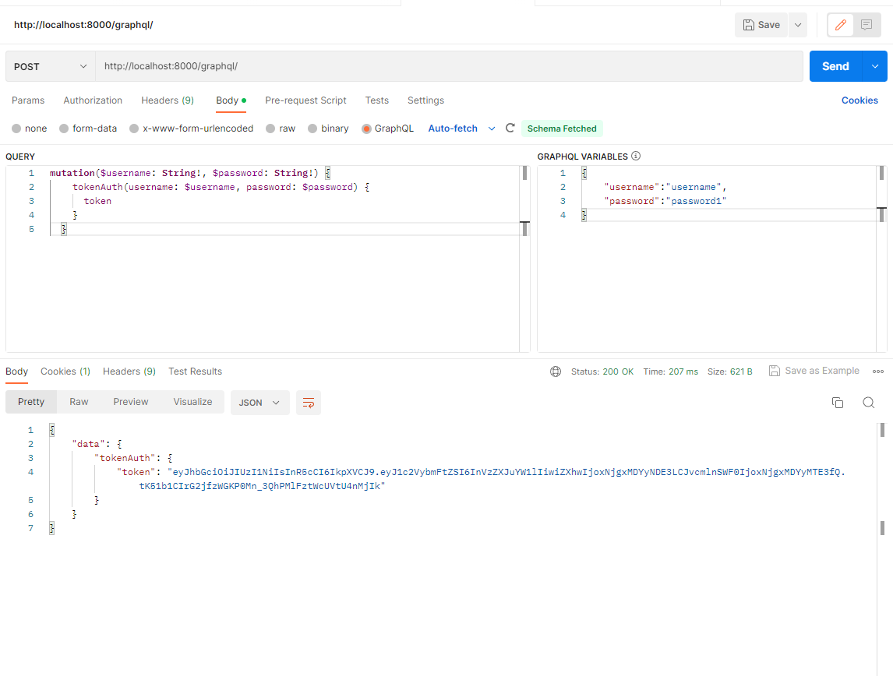
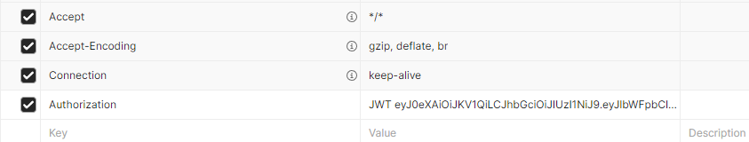

<h1 align="left">React & Graphene & Django Boilerplate</h1>

## ⭐️ Support
If you found this project helpful, please consider giving it a star! This helps us know that our work is appreciated and motivates us to keep improving it. Thank you for your support!

## Frontend ⭐

- Simple Frontend ✔
- Styled with Material-Ui✔
- Run locally ✔
- Search todo tasks ✔
- Using Query and Mutation components ✔
- Login & Registry , example to understand the JWT auth ✔

## Backend🛠

- SQLite configured ✔
- Confuigured Graphene Schema eassy to Modify ✔
- Authentication With JWT (Register, Sign In) ✔
- Run locally ✔

## How to Run locally 

### Backend

- Install requirements after creating and activating virtual environement or conda 

    $ cd Backend
    $ activate env
    $ pip install -r requirements.txt

- Currently SQLite is configured, you can change it with any other as well. Then run

    $ python manage.py makemigrations
    $ python manage.py migrate

    and finally run it
    $ python manage.py runserver
    Admin available at`http://localhost:8000/admin/`

### Frontend

    - To begin working with the frontend app, you'll first need to install the necessary dependencies. This can be done by running the following commands in a separate terminal window:

    If you don't have Node.js and npm installed on your system, you can download and install them from the official website at https://nodejs.org/en/.

    - Once the dependencies are installed, navigate to the frontend directory in your terminal and run the following command to start the development server:

    $ npm install

    $ npm start

    -  React app available at`http://localhost:3000/`

## Usage of graphene Schema

    - registry

    - get token

    - set to header

## License ©

[The MIT License](LICENSE)

